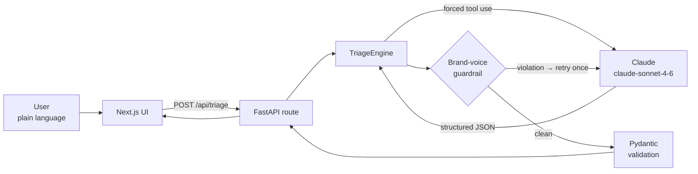

# Architecture

This document explains how the LucidLaw triage prototype is built and **why** each
decision was made. It is intentionally a small system built to a high standard — the
classification core that a production platform would grow around.

## Design goals

1. **Reliable structure.** Every request returns valid, typed JSON — no parsing surprises.
2. **Grounded brand voice.** The output reads like LucidLaw, always — enforced in code, not just hoped for in a prompt.
3. **Honest uncertainty.** Ambiguous inputs are handled gracefully, never forced into a confident guess.
4. **Clean seams.** The code is organised so the prototype reads as the seed of the production architecture, and pieces can be extracted later without rework.

## Request flow



## Key decisions

### 1. Structured output via tool use (not text parsing)
Asking a model for JSON in prose and parsing the reply is brittle: models add prose,
fences, or drift from the shape. Instead the engine defines a tool (`provide_triage_result`)
and **forces** the model to call it with `tool_choice`. Claude returns a structured object
that already matches the schema. This is the production-grade way to get machine-readable
output from an LLM.

*Code:* `app/triage/tool.py`, `app/triage/engine.py`.

### 2. Validation at the boundary
The tool output is re-validated with Pydantic (`TriageResult`) before it leaves the service.
Enums constrain `category` and `urgency`; a range constraint guarantees `confidence` is in
`[0, 1]`. A malformed model response fails loudly here rather than reaching a user.

*Code:* `app/schemas.py`.

### 3. Brand voice as code
LucidLaw's voice is a hard product requirement. Beyond the heavy prompt guidance, a small
guardrail scans the user-facing fields for combative/legalistic terms. If any appear, the
engine retries once with a reinforced instruction. Brand alignment is therefore enforced,
not merely requested.

*Code:* `app/triage/guardrails.py`, `app/triage/engine.py`.

### 4. Honest ambiguity
Uncertainty is a first-class part of the contract via `confidence`, `needs_clarification`,
and `clarifying_question`. The deliberately ambiguous "driveway" case resolves to a
low-confidence best fit with a gentle question, rather than a confident miss. (LucidLaw's
own taxonomy files neighbour issues under *tenancy & housing*, so that is the closest fit.)

### 5. Application-factory + dependency injection
`create_app()` builds the FastAPI app; the engine is constructed once at startup and shared
via application state, injected into the route with `Annotated[..., Depends(...)]`. This
keeps the engine testable and free of global state, and lets the app boot (serving `/health`
and `/docs`) even without an API key, returning a clean `503` from `/api/triage` instead of
crashing.

*Code:* `app/main.py`, `app/triage/engine.py`.

## Error handling

| Condition | Behaviour |
|---|---|
| Missing API key | App boots; `/api/triage` returns `503` with a clear message. |
| Upstream model/API error | Caught, logged, surfaced as `502` with a friendly message — never a stack trace. |
| Model returns no tool call | Raised as an engine error → `502`. |
| Invalid input (empty/oversized) | Rejected by Pydantic with `422` before any model call. |
| Slow cold start (frontend) | Client uses a 45s timeout and a clear "server may be waking up" message. |

## Security & privacy notes

- The API key is read from the environment and never committed (`.env` is git-ignored;
  `.env.example` documents the shape).
- The container runs as a non-root user.
- CORS is restricted to configured origins.
- No personal data is persisted in the prototype — requests are processed in memory only.

## Project layout

```
backend/app/
├── main.py            # FastAPI app factory, routes, middleware, error handling
├── config.py          # environment-driven settings
├── logging_config.py  # centralised logging
├── schemas.py         # Pydantic data contract (the API's source of truth)
└── triage/
    ├── categories.py  # taxonomy + jurisdiction data (single source of truth)
    ├── prompt.py      # the system prompt
    ├── tool.py        # structured-output tool schema
    ├── guardrails.py  # brand-voice detection
    └── engine.py      # orchestration: Claude → guardrail → validate
```

## The path to production

This prototype is the classification node of a larger system. The first additions for a
real deployment would be:

1. **Citation-grounded answers (RAG).** Retrieve real Australian legislation and guidance,
   and require every statement to cite a verified source. Zero-hallucination is the core
   trust requirement for legal content.
2. **A multi-agent flow with a safety layer.** Intake → classify → jurisdiction → retrieve →
   reason, with human-in-the-loop, a separated safety pathway (e.g. family/DV), and a scope
   guardrail that keeps the system firmly on the information side of the
   information-vs-advice line.
3. **A compliance foundation.** Australian data residency, an append-only audit trail, and
   consent capture — the groundwork that makes a legal product lawful and investable.
